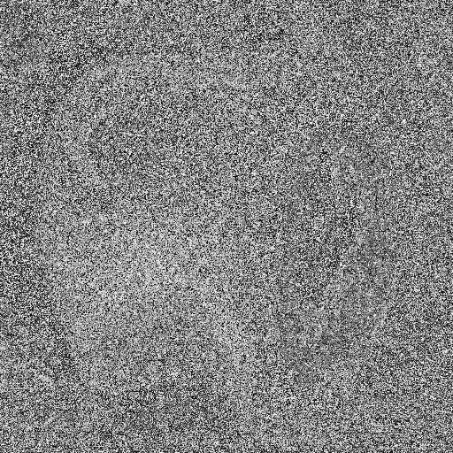
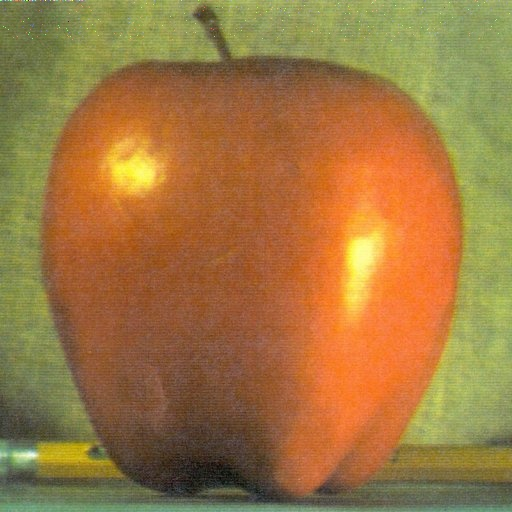

# Project Name: RSA Image Encryption with Python

## Overview

This project demonstrates image encryption and decryption using the RSA (Rivest-Shamir-Adleman) algorithm implemented in Python. The RSA algorithm is a widely used asymmetric encryption method, typically used for securing small data like keys and passwords. Although not commonly used for image encryption due to performance considerations, this project aims to showcase the principles of RSA encryption applied to image data.

## Prerequisites

- Python 3.x or later is required to run this project.
- The following libraries are needed: `numpy` and `opencv-python` (cv2).

Install the required libraries using pip:

%pip install numpy opencv-python

## Getting Started

1. Clone this repository to your local machine.
2. Make sure you have an image named "apple.jpg" in a folder named "images" in the same directory as the script.

## How RSA Image Encryption Works

1. The project generates two random prime numbers (p and q) to create the RSA key pair (public and private keys).
2. It flattens the image into a one-dimensional array and encrypts each pixel value using the RSA public key.
3. The encrypted pixel values are converted into a three-dimensional image format and saved as "encrypted_image.jpg".
4. The "encrypted_image.jpg" is decrypted using the RSA private key and saved as "decrypted_image.jpg".

## Usage

1. Run the script "RSA.ipynb" to perform the encryption and decryption.
2. After running the script, you will find the "encrypted_image.jpg" and "decrypted_image.jpg" files in the same directory.

## Examples

Here are some example images encrypted and decrypted using this project.
### Original image 

### Encrypted image

### Decrypted image

## Folder Structure

- `rsa_image_encryption.py`: Python script for image encryption and decryption.
- `images/`: Folder containing the input image (apple.jpg).
- `examples/`: Folder containing example images.
- `README.md`: This README file.

 

## Author Information

- Name: victor nisem
- Email: victornisem01@gmail.com
- LinkedIn: [www.linkedin.com/in/victor-nisem](www.linkedin.com/in/victor-nisem)

---
